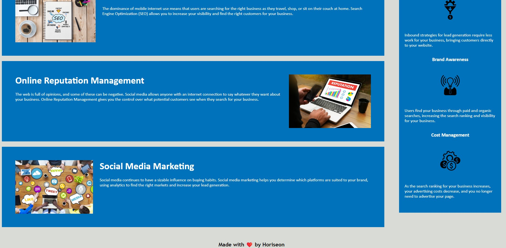

Week 1 Challenge


## Description 

This website has information on three different areas, Search Engine Optimisation, Online Reputation Management and Social Media Marketing.

I have linked the navigation bar at the top to each of the relevant sections, used semantic elements to aid with accessibility, and also rearranged and condensed the css file so it is more compact and flows in-line with the html file.

It makes a good base for any future additions or modifications the company may require.


## Usage 

This website has links at the top of the page to each of the 3 main sections.

Website images included below

```md


```

Link to active website: https://leanne-annable.github.io/Week-1-challenge/

## Licence

Licensed under the MIT Licence